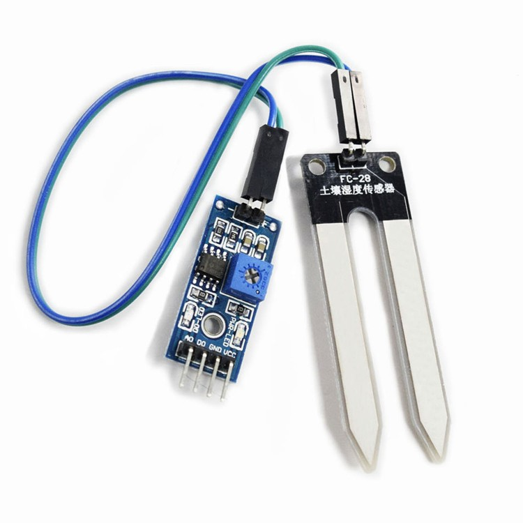

#TE215 Soil Moisture Sensor
##Sensing soil moisture with TE215 sensor.
Connect sensor to analog pin on controller
To save power and preserve the life of the probe, connect sensor's power to desired pin and pass that pin number as second parameter when calling the poll function
e.g.
```
// poll(whichPin, powerPin, intervalDuration)
poll(0, 7, 1000); 
```

 
